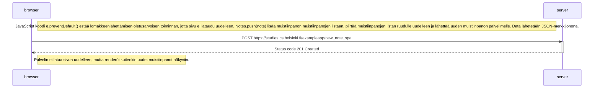

```mermaid
sequenceDiagram                     
  participant browser
  participant server

  Note right of browser: JavaScript koodi e.preventDefault() estää lomakkeenlähettämisen oletusarvoisen toiminnan, jotta sivu ei lataudu uudelleen. Notes.push(note) lisää muistiinpanon muistiinpanojen listaan, piirtää muistiinpanojen listan ruudulle uudelleen ja lähettää uuden muistiinpanon palvelimelle. Data lähetetään JSON-merkkijonona.

  browser->>server: POST https://studies.cs.helsinki.fi/exampleapp/new_note_spa
  activate server
  server-->>browser: Status code 201 Created
  deactivate server

  Note right of browser: Palvelin ei lataa sivua uudelleen, mutta renderöi kuitenkin uudet muistiinpanot näkyviin.
```
